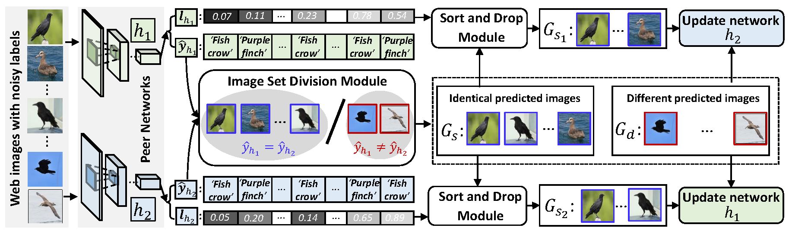

Introduction
------------
This is the source code for our paper **Peer-learning Network for Fine-Grained Recognition**

Network Architecture
--------------------
The architecture of our proposed peer-learning model is as follows


Installation
------------
After creating a virtual environment of python 3.5, run `pip install -r requirements.txt` to install all dependencies

How to use
------------
The code is currently tested only on GPU
* Data Preparation

    Download data into PLM root directory and uncompress them using
    ```
    wget https://web-fg-data.oss-cn-hongkong.aliyuncs.com/CUB200-WEB100.tar.gz
    wget https://web-fg-data.oss-cn-hongkong.aliyuncs.com/CUB200-WEB300.tar.gz
    tar -xvf CUB200-WEB100.tar.gz
    tar -xvf CUB200-WEB300.tar.gz
    ```
    Training images in **CUB200-WEB100** and **CUB200-WEB300** are all crawled from the Internet while their test images are the test data in CUB200-2011.
    **CUB200-WEB100** has 20000 training images in total while **CUB200-WEB300** has 58433 training images in total.

* Demo

    - If you just want to do a quick test on the model and check the final fine-grained recognition performance, please follow subsequent steps

      - Download one of the following trained models into `model/` using
          ```
          wget https://web-fg-data.oss-cn-hongkong.aliyuncs.com/Model/WEB100-demo-79.12.pth
          wget https://web-fg-data.oss-cn-hongkong.aliyuncs.com/Model/WEB300-demo-89.11.pth
          ```
          | Model                 | Description                                | Performance(%) |
          | --------------------- | ------------------------------------------ | -------------- |
          | WEB100-demo-79.12.pth | leveraged 100 web images for each category | 79.12          |
          | WEB300-demo-89.11.pth | leveraged 300 web images for each category | 89.11          |
      - Create a soft link for data by `ln -s CUB200-WEB100 cub200`
      - Activate virtual environment (e.g. conda)
      - Modify `CUDA_VISIBLE_DEVICES` to proper cuda device id in `cub200_demo.sh` 
      - Modify the model name in `cub200_demo.sh` according to the model downloaded.
      - Run demo using `bash cub200_demo.sh`

    - If you want to do a quick test on the model of pair flipping noisy version of cifar10 dataset, please follow subsequent steps
      - Download the following trained model into `cifar/model/` using
          ```
          wget https://web-fg-data.oss-cn-hongkong.aliyuncs.com/Model/cifar10_demo-77.40.pth
          ```
          | Model                   | Description                                                                          | Performance(%) |
          | ----------------------- | ------------------------------------------------------------------------------------ | -------------- |
          | cifar10_demo-77.40.pth  | trained from scratch on noisy cifar10 dataset (pair flipping with a noise rate 45%)  | 77.40          |
      - Activate virtual environment (e.g. conda)
      - Go into `cifar` directory
      - Modify `CUDA_VISIBLE_DEVICES` to proper cuda device id in `cifar10_demo.sh`, 
      - Modify the model name in `cifar10_demo.sh` according to the model downloaded.
      - Run demo using `cifar10_demo.sh`

* Source Code

    - If you want to train the whole network from begining using source code on the fine-grained dataset, please follow subsequent steps
    
      - Create soft link to dataset by `ln -s CUB200-WEB100 cub200`
      - Modify `CUDA_VISIBLE_DEVICES` to proper cuda device id in `cub200_run.sh`
      - Activate virtual environment(e.g. conda) and then run the script
          ```
          bash cub200_run.sh
          ```

    - If you want to train on the noisy cifar10 dataset, please follow subsequent steps
    
      - Go into `cifar` directory
      - Modify `CUDA_VISIBLE_DEVICES` to proper cuda device id in `cifar10_run.sh`
      - Activate virtual environment(e.g. conda) and then run the script
          ```
          bash cifar10_run.sh
          ```
