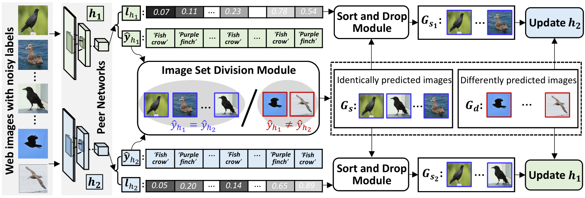
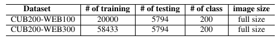
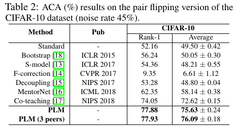

Introduction
------------
This is the source code for our paper **Peer-learning Network for Fine-Grained Recognition**

Network Architecture
--------------------
The architecture of our proposed peer-learning model is as follows


Installation
------------
After creating a virtual environment of python 3.5, run `pip install -r requirements.txt` to install all dependencies

How to use
------------
The code is currently tested only on GPU
* **Data Preparation**

    Download data into PLM root directory and uncompress them using
    ```
    wget https://web-fg-data.oss-cn-hongkong.aliyuncs.com/CUB200-WEB100.tar.gz
    wget https://web-fg-data.oss-cn-hongkong.aliyuncs.com/CUB200-WEB300.tar.gz
    tar -xvf CUB200-WEB100.tar.gz
    tar -xvf CUB200-WEB300.tar.gz
    ```
    The training data in CUB200-WEB100 and CUB200-WEB300 are collected from the Google Image Search Engine, after performing PCA-based near-duplicate removal. The testing data is directly from the CUB200-2011 test data. The detailed informations of both CUB200-WEB100 and CUB200-WEB300 are shown belows:
    <!--  -->
    <p align="center">
      
    </p>

* **Demo**

    - If you just want to do a quick test on the model and check the final fine-grained recognition performance, please follow subsequent steps

      - Download one of the following trained models into `model/` using
          ```
          wget https://web-fg-data.oss-cn-hongkong.aliyuncs.com/Model/WEB100-demo-79.12.pth
          wget https://web-fg-data.oss-cn-hongkong.aliyuncs.com/Model/WEB300-demo-89.44.pth
          ```
          | Model                 | Description                                | Performance(%) |
          | --------------------- | ------------------------------------------ | -------------- |
          | WEB100-demo-79.12.pth | leveraged 100 web images for each category | 79.12          |
          | WEB300-demo-89.44.pth | leveraged 300 web images for each category | 89.44          |
      - Create a soft link for data by `ln -s CUB200-WEB100 cub200`
      - Activate virtual environment (e.g. conda)
      - Modify `CUDA_VISIBLE_DEVICES` to proper cuda device id in `cub200_demo.sh` 
      - Modify the model name in `cub200_demo.sh` according to the model downloaded.
      - Run demo using `bash cub200_demo.sh`

    - If you want to do a quick test on the model of pair flipping noisy version of cifar10 dataset, please follow subsequent steps
      - Download the following trained model into `cifar/model/` using
          ```
          wget https://web-fg-data.oss-cn-hongkong.aliyuncs.com/Model/cifar10_demo-77.88.pth
          ```
          | Model                   | Description                                                                          | Performance(%) |
          | ----------------------- | ------------------------------------------------------------------------------------ | -------------- |
          | cifar10_demo-77.88.pth  | trained from scratch on noisy cifar10 dataset (pair flipping with a noise rate 45%)  | 77.88          |
      - Activate virtual environment (e.g. conda)
      - Go into `cifar` directory
      - Modify `CUDA_VISIBLE_DEVICES` to proper cuda device id in `cifar10_demo.sh`, 
      - Modify the model name in `cifar10_demo.sh` according to the model downloaded.
      - Run demo using `cifar10_demo.sh`

* **Source Code**

    - If you want to train the whole network from begining using source code on the fine-grained dataset, please follow subsequent steps
    
      - Create soft link to dataset by `ln -s CUB200-WEB100 cub200`
      - Modify `CUDA_VISIBLE_DEVICES` to proper cuda device id in `cub200_run.sh`
      - Activate virtual environment(e.g. conda) and then run the script
          ```
          bash cub200_run.sh
          ```

    - If you want to train on the noisy cifar10 dataset, please follow subsequent steps
    
      - Go into `cifar` directory
      - Modify `CUDA_VISIBLE_DEVICES` to proper cuda device id in `cifar10_run.sh`
      - Activate virtual environment(e.g. conda) and then run the script
          ```
          bash cifar10_run.sh
          ```

* **Using different network architectures in training**

    <span style="color:blue"><b>(Updated on July 28, 2019)</b></span>

    If you want to use different network architectures in the model, you can specify `--net1` and `--net2` when running `main.py`. 
    
    For example, if you want to train the model with `vgg16` and `resnet18`, you can modify the `cub200_run.sh` as follows:
    ```
    export CUDA_VISIBLE_DEVICES=0,1

    python main.py --dataset cub200 --base_lr 1e-3 --batch_size 128 --epoch 200 --drop_rate 0.25 --T_k 10 --weight_decay 1e-8 --step 1 --net1 vgg16 --net2 resnet18

    sleep 300

    python main.py --dataset cub200 --base_lr 1e-4 --batch_size 64 --epoch 200 --drop_rate 0.25 --T_k 10 --weight_decay 1e-5 --step 2 --net1 vgg16 --net2 resnet18
    ```

    Currentlty, supported options for different network architectures include `bcnn`, `vgg16`, `vgg19`, `resnet18`, `resnet34` and `resnet50`.

    | Network1 Architecture | Network2 Architecture | Performance(%) |
    | --------------------- | --------------------- | -------------- |
    | VGG16                 | VGG19                 | 75.28          |
    | VGG16                 | ResNet18              | 74.70          |
    | ResNet18              | ResNet34              | 75.32          |
    | ResNet34              | ResNet50              | 76.91          |

* **Using three peer networks in training on cifar10 dataset**
  
  <span style="color:blue"><b>(Updated on July 31, 2019)</b></span>

  If you want to using three peer networks while training the model, you can go into `cifar` directory, modify `CUDA_VISIBLE_DEVICES` to proper cuda device id in `cifar10_run_tri_peers.sh` and then run this script.

    <p align="center">
      
    </p>
